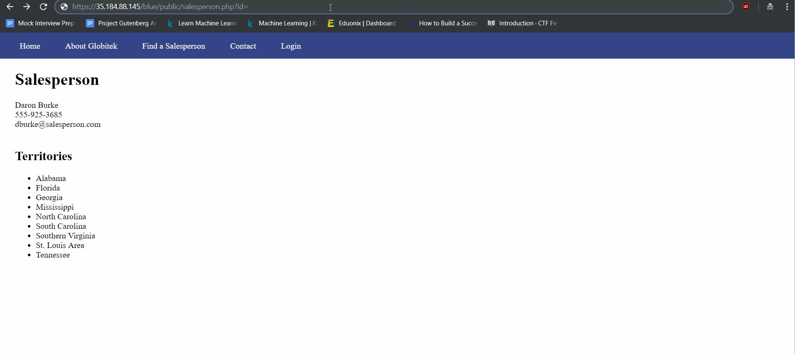
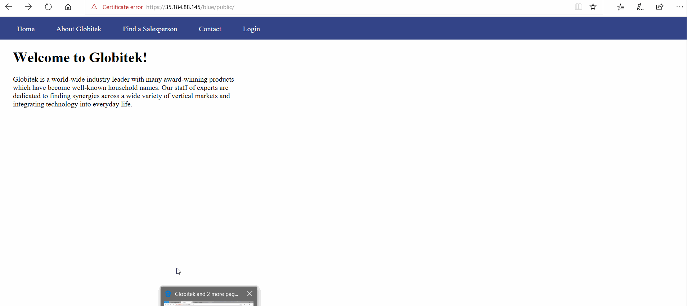
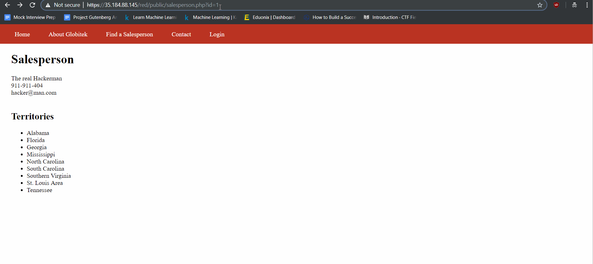

# Project 8 - Pentesting Live Targets

Time spent: **5** hours spent in total

> Objective: Identify vulnerabilities in three different versions of the Globitek website: blue, green, and red.

The six possible exploits are:
* Username Enumeration
* Insecure Direct Object Reference (IDOR)
* SQL Injection (SQLi)
* Cross-Site Scripting (XSS)
* Cross-Site Request Forgery (CSRF)
* Session Hijacking/Fixation

Each version of the site has been given two of the six vulnerabilities. (In other words, all six of the exploits should be assignable to one of the sites.)

## Blue

Vulnerability #1: SQLI
  - Entering an sql query for id in salesperson page produces a database query error, indicating this field is vulnerable to sqli 
  - [x] GIF Walkthrough: 

Vulnerability #2: Session Hijacking/Fixation
  - Logged into site, copied session id. Accessed the site from another browser that isn't logged in. Set its session id to the one that was logged in. The session is hijacked and hijacker is logged in as the user.
  - [x] GIF Walkthrough: 

## Green

Vulnerability #1: Stored XSS
  - Entering something simple such as ```` into the feedback section of the contact us page will produce a stored xss in the feedback section of the staff site. 
  - [x] GIF Walkthrough: 

Vulnerability #2: User Enumeration
  - Entering a corect username shows the error in bold, an incorrect username isn't granted a bold error. The developer used the wrong css class.
  - [x] GIF Walkthrough: 

## Red

Vulnerability #1: Insecure Direct Object Reference
  - Entering an id higher than the ones listed gives access to salespersons that aren't meant to be seen. The other sites prevented this by redirecting the user to the list.  
  - [x] GIF Walkthrough: 

Vulnerability #2: CSRF
  - Red seems to accept any random csrf token as authorized. I set up a website that automatically submits a form to change a certain person's name upon visit. I used xss to inject an iframe for that site to the feedback section. A logged in staff would trigger the xss upon visiting the feedback page.
  - [x] GIF Walkthrough: 

## Notes

Kept having to confirm security exception :(

